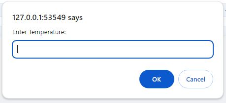
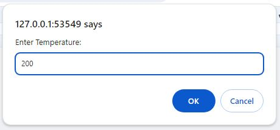

# Temperature Conversion

=====================

A simple temperature conversion tool built with JavaScript and HTML

## Table of Contents

---

- [Getting Started](#getting-started)
- [Features](#features)
- [Screenshots](#screenshots)
- [Contributing](#contributing)
- [License](#license)
- [Summary](#summary)
- [Overview](#overview)

## Getting Started

### Prerequisites

- A web browser (e.g., Google Chrome, Mozilla Firefox)

### Running the Project

1. Open the program on your local PC(The project can be accessed at `http://localhost:3000` in your web browser.)
2. Follow the prompts to convert a temperature from one unit to another.
3. Units accommodated are Celsius (C), Kelvin (K), and Fahrenheit (F)

## Features

- Convert temperatures between Celsius (C), Kelvin (K), and Fahrenheit (F)
- User-friendly prompts for inputting the current temperature and desired conversion

## Screenshots

### Conversion Example

### User is alerted on units to use

### User prompted to enter units to be converted

### User inputs K for Kelvin, in this case.

### User prompted to enter units to convert to

### User inputs C for Celsius, in this case.

### User prompted to enter temperature amount.

### User enters temperature amount,200 in this case.

### Original and converted temperature is outputted in the console.

## Contributing

### Contributor Guidelines

1. Fork the repository
2. Create a new branch for your feature or fix
3. Submit a pull request

### Code of Conduct

Please follow the [Contributor Covenant](https://www.contributor-covenant.org/version/2/0/code_of_conduct/) code of conduct.

## License

_Not applicable._

## Summary

Here's a brief overview of the project:

This temperature conversion tool allows users to convert temperatures between Celsius, Kelvin, and Fahrenheit. The user is prompted to input the current temperature and the desired conversion, and the result is displayed in the console.
"# TemperatureConversionApp" 
